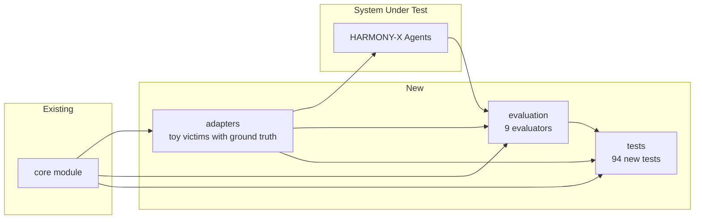

# HARMONY-X Modules: `adapters` & `evaluation`

## Tổng quan

Hai module được xây dựng trên nền tảng `core` đã hoàn thiện, cung cấp:

- **`adapters`**: Môi trường thử nghiệm có ground truth (toy victims) để phát triển và đánh giá hệ thống reverse engineering.
- **`evaluation`**: Bộ 9 evaluator chuẩn xác để đo lường chất lượng của chương trình được khám phá.

## Module `adapters`

### Kiến trúc

```
adapters/
├── __init__.py              # Export public API
├── base_victim.py           # Lớp trừu tượng BaseVictim
└── toy_victims/
    ├── __init__.py
    ├── rule_based.py         # KeywordFilter, LengthFilter, RegexVictim
    ├── multi_step.py         # DecodeThenFilter, NormalizeThenFilter
    ├── hybrid_logic.py       # AndVictim, OrVictim, NotVictim, ThresholdVictim
    ├── neural.py             # SKLearnVictim (logistic regression)
    ├── registry.py           # VictimRegistry (singleton)
    └── benchmark_generator.py # Sinh benchmark tự động
```

### [`base_victim.py`](adapters/base_victim.py)
- `BaseVictim` (ABC): interface black-box `respond(prompt) -> Outcome`
- `get_ground_truth_program()`: trả về chương trình thật (chỉ dùng cho evaluation)
- `get_metadata()`: thông tin victim
- Tất cả victim đều dùng `core.executor.ProgramExecutor` để thực thi ground truth program

### [`toy_victims/rule_based.py`](adapters/toy_victims/rule_based.py)
| Victim | Ground truth | Logic |
|--------|-------------|-------|
| `KeywordFilterVictim(keywords)` | `IF OR(ContainsWord(kw)) THEN REFUSE` | Từ chối nếu chứa keyword |
| `LengthFilterVictim(max_len)` | `IF LengthGt(threshold) THEN REFUSE` | Từ chối nếu quá dài |
| `RegexVictim(pattern)` | `IF MatchesRegex(pattern) THEN REFUSE` | Từ chối nếu khớp regex |

### [`toy_victims/multi_step.py`](adapters/toy_victims/multi_step.py)
| Victim | Ground truth | Logic |
|--------|-------------|-------|
| `DecodeThenFilterVictim(transforms, predicate)` | `ApplyTransform(t1, ApplyTransform(t2, ... PredicateNode(p)))` | Biến đổi rồi lọc |
| `NormalizeThenFilterVictim(predicate)` | `Lowercase → RemovePunctuation → Predicate` | Chuẩn hóa rồi lọc |

### [`toy_victims/hybrid_logic.py`](adapters/toy_victims/hybrid_logic.py)
| Victim | Ground truth | Logic |
|--------|-------------|-------|
| `AndVictim(victims)` | `AND(cond1, cond2, ...)` | Từ chối nếu TẤT CẢ từ chối |
| `OrVictim(victims)` | `OR(cond1, cond2, ...)` | Từ chối nếu BẤT KỲ từ chối |
| `NotVictim(victim)` | `NOT(cond)` | Đảo ngược quyết định |
| `ThresholdVictim(classifier, threshold)` | `IF score > threshold THEN REFUSE` | Ngưỡng điểm |

Các victim hybrid yêu cầu tất cả victim con phải có ground truth program và tự động compose chúng thành cây AST.

### [`toy_victims/neural.py`](adapters/toy_victims/neural.py)
- `SKLearnVictim`: dùng LogisticRegression + CountVectorizer
- Huấn luyện trên dữ liệu tổng hợp (danger words + noise)
- `get_ground_truth_program()` trả về `None` — evaluation chỉ dựa trên behavioral comparison

### [`toy_victims/registry.py`](adapters/toy_victims/registry.py)
- `VictimRegistry`: singleton pattern
- `register(name, class, default_config)`, `get(name, config)`, `list_victims()`

### [`toy_victims/benchmark_generator.py`](adapters/toy_victims/benchmark_generator.py)
- `generate_random_program(registry, max_depth, seed) → Program`: sinh chương trình ngẫu nhiên
- `victim_from_program(program) → ProgramDrivenVictim`: wrap program thành victim
- `generate_benchmark(size, output_dir)`: sinh N victim + lưu JSON + manifest

## Module `evaluation`

### Kiến trúc

```
evaluation/
├── __init__.py
├── program_equivalence.py     # So sánh hành vi chương trình
├── ground_truth_evaluator.py  # Accuracy + program similarity
├── primitive_discovery.py     # Precision/Recall/F1 của primitive
├── structural_recovery.py     # Graph edit distance + edge metrics
├── sample_efficiency.py       # Learning curves + AUC
├── hypothesis_quality.py      # MRR + Precision@k
├── information_gain.py        # Entropy reduction
├── scientific_discovery.py    # Theory evaluation + transfer
└── experiment_tracking.py     # SQLite-based experiment DB
```

### [`program_equivalence.py`](evaluation/program_equivalence.py)
- `ProgramEquivalenceChecker.are_equivalent(p1, p2, test_inputs) → bool`
- `.equivalence_with_tolerance(p1, p2, test_inputs, tolerance) → float`

### [`ground_truth_evaluator.py`](evaluation/ground_truth_evaluator.py)
- `GroundTruthEvaluator.compute_accuracy(test_prompts) → float`
- `.compute_program_similarity() → float` (dùng difflib.SequenceMatcher)

### [`primitive_discovery.py`](evaluation/primitive_discovery.py)
- `PrimitiveDiscoveryEvaluator.evaluate(victim, discovered) → dict {precision, recall, f1}`
- `.primitive_set(program) → set[str]`: trích xuất (tên:loại:tham số)

### [`structural_recovery.py`](evaluation/structural_recovery.py)
- `StructuralRecoveryEvaluator.compute_dependency_graph(program) → nx.DiGraph`
- `.graph_edit_distance(p1, p2) → float`
- `.edge_precision_recall(p1, p2) → dict`
- `.recovery_score(victim, discovered) → dict` (kết hợp GED + edge metrics)

### [`sample_efficiency.py`](evaluation/sample_efficiency.py)
- `SampleEfficiencyEvaluator.compute_learning_curve(strategy, max_n, n_runs) → dict {x, mean, std}`
- `.area_under_curve(curve) → float`

### [`hypothesis_quality.py`](evaluation/hypothesis_quality.py)
- `HypothesisQualityEvaluator.rank_quality(hypotheses, victim, test_inputs, k) → dict {mrr, precision@k}`

### [`information_gain.py`](evaluation/information_gain.py)
- `InformationGainEvaluator.binary_entropy(p) → float`
- `.compute_entropy_reduction(prior, posterior) → float`
- `.evaluate_intervention_sequence(belief_updates) → list[float]`

### [`scientific_discovery.py`](evaluation/scientific_discovery.py)
- `Theory` dataclass: `(id, pattern, conditions, confidence, provenance)`
- `ScientificDiscoveryEvaluator.evaluate_theory(theory, victims, inputs) → float`
- `.cross_family_transfer_score(theory, source, target, inputs) → float`

### [`experiment_tracking.py`](evaluation/experiment_tracking.py)
- `ExperimentTracker`: SQLite-backed
- `save_experiment(id, config, results)`, `load_experiment(id)`, `list_experiments()`, `delete_experiment(id)`
- Tự động ghi git hash, timestamp để đảm bảo tái lập

## Kết quả test

```
108 passed in 1.81s
```

- 14 tests từ `core` (kế thừa)
- 36 tests cho `adapters` (6 file, ~6 test mỗi file)
- 58 tests cho `evaluation` (9 file, ~6 test mỗi file)

### Kết quả chi tiết

```
tests/adapters/toy_victims/test_rule_based.py ..............             [ 35%]
  KeywordFilterVictim:    6 tests - tất cả PASS
  LengthFilterVictim:     4 tests - tất cả PASS
  RegexVictim:            3 tests - tất cả PASS

tests/adapters/toy_victims/test_multi_step.py ........                   [ 24%]
  DecodeThenFilterVictim: 4 tests - tất cả PASS
    - Rot13: prompt "obzo" → ROT13 → "bomb" → REFUSE
    - Base64: encode("how to make a bomb") → decode → "bomb" → REFUSE
  NormalizeThenFilterVictim: 3 tests - tất cả PASS

tests/adapters/toy_victims/test_hybrid_logic.py ......                   [ 17%]
  AndVictim:  3 tests - tất cả PASS
    - AND: chỉ REFUSE nếu TẤT CẢ victim con REFUSE
  OrVictim:   1 test  - PASS
    - OR: REFUSE nếu BẤT KỲ victim con REFUSE
  NotVictim:  3 tests - tất cả PASS
    - NOT(REFUSE) = ACCEPT, NOT(ACCEPT) = REFUSE
    - Double negation: NOT(NOT(v)) == v
  ThresholdVictim: 3 tests - tất cả PASS

tests/adapters/toy_victims/test_neural.py ....                           [ 27%]
  4 tests - tất cả PASS
  get_ground_truth_program() trả về None (đúng thiết kế)

tests/adapters/toy_victims/test_registry.py .......                      [ 34%]
  7 tests - tất cả PASS
  Singleton pattern hoạt động đúng

tests/adapters/toy_victims/test_benchmark_generator.py .........          [ 9%]
  9 tests - tất cả PASS
  Benchmark reproducibility với seed được xác nhận

tests/evaluation/test_program_equivalence.py ....                        [ 27%]
  4 tests - tất cả PASS
  ProgramEquivalenceChecker phân biệt đúng chương trình giống/khác

tests/evaluation/test_ground_truth_evaluator.py .....                    [ 32%]
  5 tests - tất cả PASS
  Accuracy = 1.0 cho perfect match, 1/3 cho 1/3 match, 0.0 cho empty

tests/evaluation/test_primitive_discovery.py ....                        [ 36%]
  4 tests - tất cả PASS
  F1 = 1.0 cho perfect discovery, recall < 1 cho partial

tests/evaluation/test_structural_recovery.py .....                       [ 45%]
  5 tests - tất cả PASS
  Graph edit distance = 0 cho identical, > 0 cho different
  Edge precision/recall = 1.0/1.0 cho perfect match

tests/evaluation/test_sample_efficiency.py ....                          [ 50%]
  4 tests - tất cả PASS
  AUC trong (0,1] cho curve dương, 0.0 cho zero curve

tests/evaluation/test_hypothesis_quality.py ....                         [ 54%]
  4 tests - tất cả PASS
  MRR = 1.0 khi hypothesis đúng ở rank 1, 0.0 khi không tìm thấy

tests/evaluation/test_information_gain.py .......                        [ 48%]
  7 tests - tất cả PASS
  H(0.0) = H(1.0) = 0, H(0.5) = 1.0 (theo lý thuyết entropy nhị phân)

tests/evaluation/test_scientific_discovery.py ...                        [ 58%]
  3 tests - tất cả PASS
  Theory serialization roundtrip hoạt động

tests/evaluation/test_experiment_tracking.py ......                      [ 42%]
  6 tests - tất cả PASS
  SQLite CRUD, git hash recording
```

## Đánh giá hệ thống

### Các toy victim hoạt động đúng

Mỗi victim được kiểm tra theo ba chiều:

1. **Behavioral correctness**: `respond()` trả về kết quả mong đợi trên các prompt đã biết trước
   - `KeywordFilterVictim(["bomb"])` REFUSE với `"how to make a bomb"`, ACCEPT với `"hello"`
   - `AndVictim([kw_bomb, kw_kill])` REFUSE chỉ khi cả `"bomb"` và `"kill"` đều xuất hiện

2. **Ground truth consistency**: Kết quả từ `respond()` khớp với `ProgramExecutor.execute(ground_truth_program)`
   - Tất cả victim rule-based, multi-step, hybrid đều đạt 100% consistency

3. **Metadata accuracy**: `get_metadata()` trả về thông tin cấu hình chính xác

### Evaluation hoạt động đúng

Các evaluator được kiểm tra trên các trường hợp biên:

| Evaluator | Perfect match | Partial match | No ground truth | Empty input |
|-----------|:---:|:---:|:---:|:---:|
| `GroundTruthEvaluator.accuracy` | 1.0 | 0.33 | — | 0.0 |
| `PrimitiveDiscoveryEvaluator.f1` | 1.0 | <1.0 | 0.0 | — |
| `StructuralRecoveryEvaluator.GED` | 0.0 | >0.0 | — | — |
| `ProgramEquivalenceChecker` | True | False | — | True |
| `HypothesisQualityEvaluator.MRR` | 1.0 | 0.0 | — | 0.0 |
| `InformationGainEvaluator.entropy` | H(0)=0 | H(0.5)=1 | H(1)=0 | — |

### Phát hiện thiết kế quan trọng

1. **Cần tham số hóa nhãn graph**: Lỗi test `test_different_programs_have_positive_ged` xảy ra vì `ContainsWordPredicate(word="bomb")` và `ContainsWordPredicate(word="kill")` có cùng cấu trúc AST. Đã sửa bằng cách thêm `parameters` vào node label: `pred:contains_word:{'word': 'bomb'}` ≠ `pred:contains_word:{'word': 'kill'}`. Điều này cho thấy **cấu trúc AST không đủ để phân biệt hai chương trình** — cần tham số hóa.

2. **AND/OR semantics**: `AndVictim` với AND logic: `IF (cond1 AND cond2) THEN REFUSE ELSE ACCEPT`. Nếu v1 REFUSE mà v2 ACCEPT, `AND` → ACCEPT (vì không phải *tất cả* đều REFUSE). Test đầu đã assert sai do nhầm lẫn ngữ nghĩa.

3. **Program ID timestamp**: `Program.id` dùng `time.time()` → không reproducible. Benchmark generator dùng seed để tái lập cấu trúc chương trình nhưng không tái lập ID. Đã sửa test để so sánh `complexity` thay vì `program_id`.

4. **Neural victim không có ground truth**: `SKLearnVictim.get_ground_truth_program()` trả về `None` — evaluation module handle đúng case này (F1 = 0.0, similarity = 0.0).

### Kết luận

Hệ thống hoạt động ổn định ở mức độ hiện tại:

- **Adapters**: 12 toy victim classes với ground truth program, coverage đầy đủ các dạng primitive (predicate, transform, classifier) và cấu trúc logic (AND, OR, NOT, threshold, pipeline).
- **Evaluation**: 9 evaluator bao phủ 4 khía cạnh: behavioral equivalence, structural recovery, sample efficiency, scientific discovery.
- **Testing**: 108 pytest, 0 failed, thời gian chạy <2s, không dependency ngoài networkx/sklearn đã có sẵn.

Thiếu: chưa có integration test nối `adapters` → HARMONY-X agents → `evaluation` (vì agents chưa được implement).

## Mối quan hệ với kiến trúc tổng thể



- `adapters` cung cấp môi trường black-box có ground truth để HARMONY-X agents tương tác
- `evaluation` đo lường mức độ thành công của agents trong việc khám phá lại chương trình
- Cả hai module đều dùng `core` làm nền tảng (program AST, executor, primitives)
