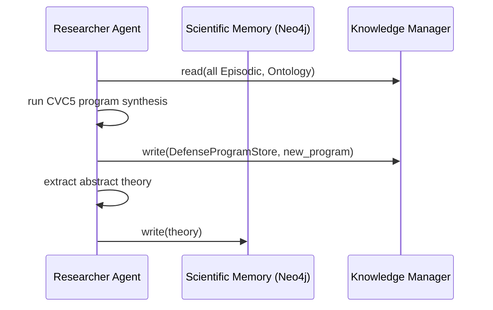

# Scientific Memory (L6) — HARMONY-X

## Mục đích

Scientific Memory lưu trữ các **lý thuyết trừu tượng** về chính sách an toàn của LLM, được trích xuất từ các chương trình phòng thủ đã xác nhận. Mỗi lý thuyết có thể được chuyển giao giữa các họ mô hình (RLHF, Constitutional AI, …) để khởi tạo prior cho các chiến dịch reverse engineering mới.

Đây là tầng L6 trong kiến trúc bộ nhớ phân cấp 6 tầng của HARMONY-X:

| Tầng | Tên | Vật lý | Nội dung |
|------|-----|--------|----------|
| L1 | Episodic Memory | SQLite | Raw (prompt, response, outcome) |
| L2 | Session Memory | Redis | Tóm tắt chiến dịch |
| L3 | Strategy Memory | Neo4j | Chiến lược tấn công đồ thị |
| L4 | Defense Program Store | Neo4j | Chương trình Π đã xác nhận |
| L5 | Ontology Memory | Neo4j | Primitive generic |
| **L6** | **Scientific Memory** | **Neo4j** | **Lý thuyết trừu tượng T** |

---

## File cấu trúc

```
harmony-x/
├── knowledge/
│   ├── __init__.py                    # Export ScientificMemory, Theory
│   ├── scientific_memory.py           # Module chính
│   ├── SCIENTIFIC_MEMORY.md           # Tài liệu này
│   ├── episodic/                      # Module episodic (đã có)
│   └── ...
└── tests/
    └── knowledge/
        └── test_scientific_memory.py  # 34 tests
```

---

## Cài đặt Neo4j

### Yêu cầu

- Python package: `neo4j` (`pip install neo4j`)
- Neo4j server (community edition) đang chạy trên `localhost:7687`

### Cài đặt Neo4j trên macOS (Homebrew)

```bash
brew install neo4j
brew services start neo4j

# Đổi password nếu cần (mặc định là neo4j/neo4j)
python -c "
from neo4j import GraphDatabase
d = GraphDatabase.driver('bolt://localhost:7687', auth=('neo4j', 'neo4j'))
with d.session(database='system') as s:
    s.run('ALTER CURRENT USER SET PASSWORD FROM \$old TO \$new',
          old='neo4j', new='password')
d.close()
"
```

### Cài đặt Neo4j bằng Docker

```bash
docker run -d \
    --name neo4j-harmony \
    -p 7687:7687 \
    -p 7474:7474 \
    -e NEO4J_AUTH=neo4j/password \
    neo4j:5
```

### Cấu hình mặc định

| Tham số | Giá trị mặc định |
|---------|-----------------|
| URI | `bolt://localhost:7687` |
| Username | `neo4j` |
| Password | `password` |
| Database | `neo4j` |

Có thể tuỳ chỉnh qua biến môi trường `NEO4J_URI`, `NEO4J_USER`, `NEO4J_PASSWORD` (dùng trong test).

---

## Lớp dữ liệu: `Theory`

```python
@dataclass
class Theory:
    pattern: str                        # Luật logic hoặc đoạn chương trình
    conditions: Dict[str, Any]          # Điều kiện áp dụng (VD: {"model_family": "RLHF"})
    confidence: float                   # [0.0, 1.0] — tự động clamp
    provenance: List[str]               # Danh sách episode/intervention ID xác nhận
    id: str = ""                        # UUID: tự sinh (thr_<hex>) nếu để trống
    version: int = 1                    # Version number (1-based, auto-managed)
    created_at: float                   # Unix timestamp of first creation
    updated_at: float                   # Unix timestamp of this version
    metadata: Dict[str, Any]            # Metadata tuỳ chọn
```

Mỗi lần `save_theory()` tạo một **version** mới (tăng dần). `get_theory()` luôn trả về version mới nhất.

---

## Lớp `ScientificMemory`

### Kết nối

```python
from knowledge.scientific_memory import ScientificMemory, Theory

memory = ScientificMemory(
    uri="bolt://localhost:7687",
    user="neo4j",
    password="password",
    database="neo4j",
)

# Context manager tự động đóng kết nối
with ScientificMemory() as m:
    m.save_theory(theory)
```

### Schema Neo4j

- **Node label:** `Theory`
- **Indexes & constraints** (tự động tạo bởi `_ensure_constraints()`):
  - `(id, version)` UNIQUE — composite constraint cho phép nhiều version cùng id
  - `confidence` — index
  - `model_family`, `cipher`, `model_architecture`, etc. — indexes trên các condition keys phổ biến
- **Properties (lưu dưới dạng dynamic properties cho conditions):**
  - `id` (TEXT), `version` (INT)
  - `pattern` (TEXT), `confidence` (FLOAT)
  - `provenance` (TEXT — JSON array)
  - `conditions_json` (TEXT — JSON, dùng cho export/import)
  - `created_at` (FLOAT), `updated_at` (FLOAT)
  - `metadata` (TEXT — JSON)
  - Mỗi key trong `conditions` → property riêng (VD: `model_family: "RLHF"`)
- **Relationship:** `(:Theory)-[:NEXT_VERSION]->(:Theory)` — chain giữa các version

### CRUD methods

| Method | Mô tả |
|--------|-------|
| `save_theory(theory) → str` | Tạo version mới (tăng dần). Trả về id. |
| `get_theory(theory_id) → Optional[Theory]` | Lấy version mới nhất. |
| `get_theory_version(theory_id, version) → Optional[Theory]` | Lấy version cụ thể. |
| `find_theories(conditions, min_confidence) → List[Theory]` | Tìm theory theo conditions + min_confidence. |
| `find_theories_by_pattern(keyword, case_sensitive, min_confidence) → List[Theory]` | Tìm theory theo pattern substring. |
| `update_confidence(theory_id, new_confidence) → bool` | Tạo version mới với confidence cập nhật. |
| `delete_theory(theory_id) → bool` | Xoá **tất cả** version của theory. |
| `delete_all() → int` | Xoá toàn bộ theory (dùng trong test). |

### Xuất nhập

| Method | Mô tả |
|--------|-------|
| `export_theories(file_path, include_history=True)` | Export theories ra JSON. Mặc định bao gồm lịch sử. |
| `import_theories(file_path, include_history=True, overwrite_existing=False) → int` | Import từ JSON. Skip version đã tồn tại nếu `overwrite_existing=False`. |

### Tính năng nổi bật

#### 1. Dynamic conditions — filtering tại Cypher level

Các key-value từ `conditions` được lưu thành **dynamic properties** riêng trên node `Theory`:

```python
theory = Theory(
    pattern="IF rot13(x) contains 'bomb' THEN REFUSE",
    conditions={"model_family": "RLHF", "cipher": "rot13"},
)
memory.save_theory(theory)
# → Node có properties: model_family="RLHF", cipher="rot13"
```

Khi query, Cypher `WHERE t.model_family = $cond` được xây dựng động — không cần filter trong Python:

```cypher
MATCH (t:Theory)
WHERE t.confidence >= 0.7
  AND NOT EXISTS ((t)-[:NEXT_VERSION]->())
  AND t.model_family = 'RLHF'
  AND t.cipher = 'rot13'
RETURN t
```

#### 2. Versioning với NEXT_VERSION chain

Mỗi lần save tạo một node mới với `version++`:

```
(:Theory {id: "T1", version: 1, pattern: "v1", created_at: 100})
    -[:NEXT_VERSION]->
(:Theory {id: "T1", version: 2, pattern: "v2", created_at: 100, updated_at: 200})
```

- `get_theory("T1")` → version 2 (latest, không có `NEXT_VERSION` outgoing)
- `get_theory_version("T1", 1)` → version 1
- `delete_theory("T1")` → xoá tất cả version

#### 3. Pattern substring search

```python
theories = memory.find_theories_by_pattern("rot13", case_sensitive=False)
```

Sử dụng Cypher `CONTAINS`:

```cypher
MATCH (t:Theory)
WHERE toLower(t.pattern) CONTAINS toLower('rot13')
  AND t.confidence >= 0.0
  AND NOT EXISTS ((t)-[:NEXT_VERSION]->())
RETURN t
```

#### 4. Export/Import với version history

```python
# Export tất cả versions (mặc định)
memory.export_theories("backup.json", include_history=True)

# Import — skip version đã tồn tại
count = memory.import_theories("backup.json", overwrite_existing=False)

# Import — ghi đè version đã tồn tại
count = memory.import_theories("backup.json", overwrite_existing=True)

# Chỉ export/import version mới nhất
memory.export_theories("latest.json", include_history=False)
memory.import_theories("latest.json", include_history=False)
```

---

## Kiến trúc

### Luồng dữ liệu

Scientific Memory là một phần của **Knowledge Layer**, được ghi bởi **Researcher Agent** (single-writer ownership). Các agent khác chỉ đọc, muốn ghi phải gửi proposal qua Redis queue.



### Vai trò trong vòng lặp khám phá

1. Researcher Agent tổng hợp chương trình Π từ các can thiệp.
2. Sau khi xác nhận, nó trích xuất luật trừu tượng → Scientific Memory.
3. Khi gặp mô hình mới, Researcher Agent query Scientific Memory để lấy theories phù hợp với `conditions` (model family, cipher type, v.v.).
4. Lý thuyết được dùng làm prior → giảm số can thiệp cần thiết.

### Ví dụ sử dụng cho Researcher Agent

```python
# Khi bắt đầu chiến dịch mới trên model RLHF
theories = memory.find_theories(
    conditions={"model_family": "RLHF"},
    min_confidence=0.7,
)
for t in theories:
    print(f"Prior theory: {t.pattern} (confidence={t.confidence})")

# Tìm theory liên quan đến ROT13
rot13_theories = memory.find_theories_by_pattern(
    "rot13", case_sensitive=False, min_confidence=0.5
)
```

---

## Tests

### File: `tests/knowledge/test_scientific_memory.py`

**34 tests** — 5 pure unit + 29 Neo4j integration:

| Nhóm | Số test | Mô tả |
|------|---------|-------|
| `TestTheoryDataclass` | 5 | auto ID, clamp confidence, default/clamp version, dict roundtrip |
| Versioning | 6 | version 1, increment, get version, nonexistent version, nonexistent theory, preserve created_at |
| Dynamic conditions | 6 | by conditions, no match, min confidence, combined, multiple conditions, empty conditions, zero confidence |
| Pattern search | 4 | substring, case insensitive, case sensitive, with confidence |
| Update confidence | 3 | creates new version, nonexistent, clamping |
| Delete | 3 | removes all versions, nonexistent, delete_all |
| Export/Import | 5 | roundtrip latest, with history, skip existing, overwrite existing, empty list |
| Other | 1 | context manager |

### Chạy tests

```bash
# Tất cả tests (Neo4j phải đang chạy)
python -m pytest tests/knowledge/test_scientific_memory.py -v

# Nếu Neo4j không chạy, integration tests sẽ SKIP với hướng dẫn Docker
# Chỉ chạy Theory unit tests:
python -m pytest tests/knowledge/test_scientific_memory.py \
    -k "TestTheoryDataclass" -v
```

### Biến môi trường

| Biến | Mặc định | Mô tả |
|------|----------|-------|
| `NEO4J_URI` | `bolt://localhost:7687` | Neo4j Bolt URI |
| `NEO4J_USER` | `neo4j` | Tên đăng nhập |
| `NEO4J_PASSWORD` | `password` | Mật khẩu |

---

## Các cải thiện gần đây

### 1. Dynamic conditions filtering (Cypher-level)

**Trước:** `find_theories()` trả về tất cả theory rồi filter bằng Python.

**Sau:** Mỗi key-value của `conditions` được lưu thành dynamic property riêng trên node. Query sử dụng `WHERE` trực tiếp trong Cypher, tận dụng index. Xem `_KNOWN_CONDITION_KEYS` và `_safe_cypher_prop()`.

### 2. Versioning

- Thêm `version: int` và `updated_at: float` vào `Theory`.
- `save_theory()` tạo node mới với `version++` thay vì ghi đè.
- Các phiên bản liên kết bằng `NEXT_VERSION` relationship.
- `get_theory()` trả về version mới nhất (`NOT EXISTS ((t)-[:NEXT_VERSION]->())`).
- `get_theory_version(id, version)` cho truy xuất lịch sử.

### 3. Pattern substring search

- `find_theories_by_pattern(keyword, case_sensitive, min_confidence)` sử dụng Cypher `CONTAINS`.

### 4. Export/Import nâng cao

- `export_theories(file_path, include_history=True)` — mặc định export tất cả versions.
- `import_theories(file_path, include_history=True, overwrite_existing=False)` — có kiểm soát skip/overwrite.

### 5. Schema migration

- `_ensure_constraints()` tự động phát hiện và xoá constraint cũ `(id) IS UNIQUE`, thay bằng `(id, version) IS UNIQUE`.
- Index trên `confidence` và các condition keys phổ biến.

### Kết quả

- **205 tests tất cả đều pass** (171 cũ + 34 mới)
- **Thời gian chạy:** ~4.9s
- **Module Scientific Memory:** 34/34 tests pass (khi có Neo4j)
- **Nếu không có Neo4j:** 5 unit tests vẫn pass, 29 integration tests SKIP
